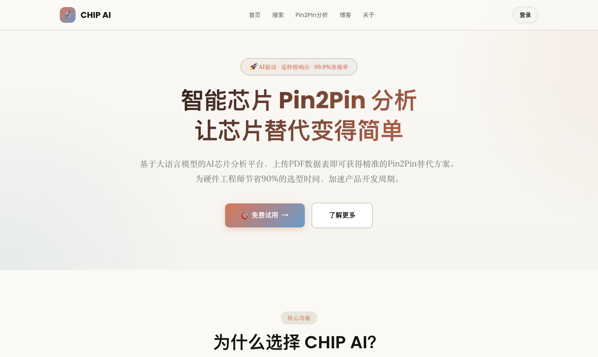
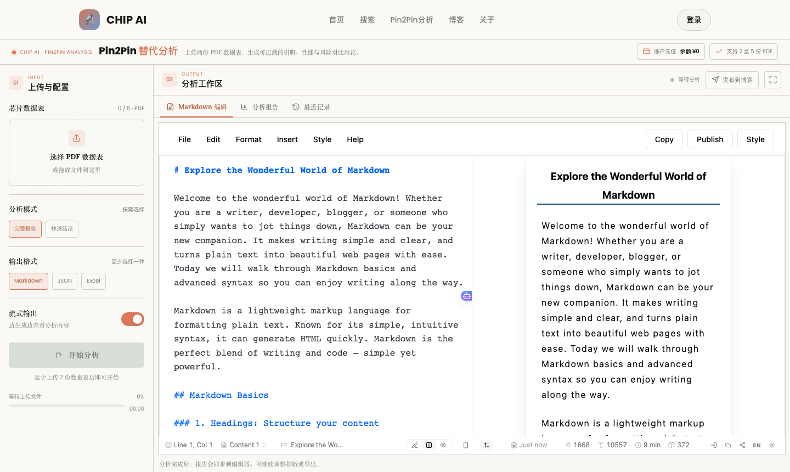

<div align="center">

# AI-P2P · 智能芯片 Pin2Pin 替代分析平台

上传两份 PDF 数据表，一键生成可追溯的芯片替代对比报告，让研发、采购与客户一眼看懂每一颗芯片的价值。


</div>

---

## 简介

工程师和采购拿到两份数据手册，真正想知道的只有三件事：**能不能用、差在哪、有什么风险**。

AI-P2P 把复杂判断沉淀在背后——每一类模拟芯片（运放、ADC、电源、接口芯片……）该对比哪些关键参数，已经内置成专业的对比维度并持续迭代；用户只需上传 PDF，一键获得结论：

- 封装与引脚是否真正 **Pin-to-Pin** 兼容
- 电气参数逐项优劣对比
- 替代可行性、风险要点与适配建议

## 功能特性

| 能力 | 说明 |
| --- | --- |
| 🤖 AI Pin2Pin 分析 | PDF 解析（pdf-inspector + PDFBox 兜底）→ 芯片参数提取 → LLM 结构化对比 |
| ⚡ 两种分析模式 | **快速结论**（约 7s）／**完整报告**（六章节，约 75s），流式输出 |
| 📊 分析进度 | 阶段化进度条 + 耗时统计（解析 → 提取 → LLM → 保存） |
| 🧠 历史沉淀 | 分析记录自动入历史库，相似型号分析自动参考历史结论保持一致性 |
| 📚 芯片库自建 | 每次分析自动沉淀芯片型号、厂商、参数摘要到 `chip` 表 |
| 📝 doocs/md 编辑器 | 报告自动同步到 Markdown 编辑器，支持沉浸式全屏编辑 |
| 📤 一键发布博客 | 报告一键发布到内置博客系统，直达 `/blog` |
| 💰 余额与支付 | 支付宝充值、余额展示、消费流水（`/payment`） |
| 🔒 安全配置 | 密钥全部环境变量化，仓库零明文凭据 |

## 界面预览

<div align="center">
  
  <br/><br/>
  
</div>

## 技术架构

```
┌──────────────────────────────────────────────┐
│  表现层  Thymeleaf · jQuery · doocs/md      │
├──────────────────────────────────────────────┤
│  业务层  ChipAnalyze · ChipLibrary · Payment │
├──────────────────────────────────────────────┤
│  数据层  MyBatis + MySQL 8 (chip 库)        │
├──────────────────────────────────────────────┤
│  AI 能力  OpenAI 兼容 LLM · pdf-inspector   │
│           DeepSeek（快速/完整双模式）        │
└──────────────────────────────────────────────┘
```

- **后端**：Java 17 · Spring Boot 3.4 · MyBatis · MySQL 8 · SSE 流式
- **前端**：Thymeleaf · jQuery · marked · highlight.js · doocs/md
- **AI**：DeepSeek 官方 API（`reasoning_effort=none` 保证交互速度），PDF 解析优先 `@firecrawl/pdf-inspector`，失败回退 Apache PDFBox

## 快速开始

前置：Java 17、Node.js 20、MySQL 8。

```bash
# 1. 初始化数据库
mysql -uroot -p < chip.sql

# 2. 安装 PDF 解析依赖
cd scripts/pdf-inspector && npm ci && cd ../..

# 3. 配置环境变量（或复制 .env.example）
export DB_PASSWORD=your_password
export DEEPSEEK_API_KEY=your_key

# 4. 启动
./mvnw spring-boot:run   # 默认端口 80
```

访问 `http://localhost/`（默认账号见本地配置）。

## 环境变量

敏感配置全部通过环境变量注入，仓库不保留任何明文凭据：

| 变量 | 说明 |
| --- | --- |
| `DB_URL` / `DB_USERNAME` / `DB_PASSWORD` | MySQL 连接 |
| `RSA_PUBLIC_KEY` / `RSA_PRIVATE_KEY` | 登录加密 RSA 密钥 |
| `DEEPSEEK_API_KEY` / `VOLC_API_KEY` / `GPT_API_KEY` | LLM 供应商 |
| `DEEPSEEK_REASONING_EFFORT` | 默认 `none`（追求交互速度），可设 `low/medium/high` |
| `ALIPAY_APP_ID` / `ALIPAY_PRIVATE_KEY` / `ALIPAY_PUBLIC_KEY` | 支付宝支付 |

完整列表见 [`.env.example`](.env.example)。

## CI / CD

- **PR 流程**：功能分支 → 提 PR → CI 必检通过 → 合并 `main`
- **CI**（GitHub Actions）：Java 编译 · 单元测试 · MySQL 集成 · JAR 构建 · pdf-inspector 校验
- **CD**：推送 `v*` tag 自动构建并发布 JAR 到 GitHub Release
- **Dependabot**：Maven / npm / GitHub Actions 依赖周更

## 开发约定

- 分支：`feature/*`、`fix/*`；合并走 squash，PR 后自动删分支
- 运行数据（`files/`）、`application-local.yml`、`node_modules` 不入库
- 详见 [AGENTS.md](AGENTS.md)

## License

未指定许可证，版权归项目作者所有。
